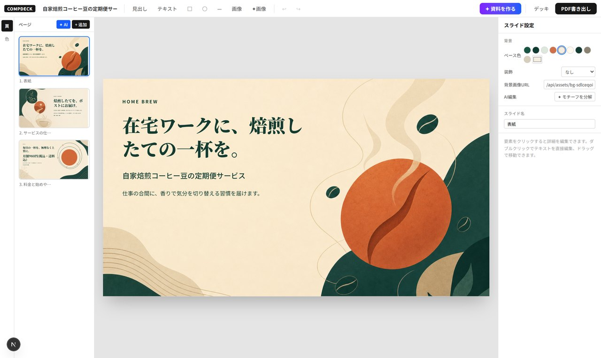

# CompDeck

[English README is here](README.md)



AIでスライドデッキを一括生成し、全パーツをWeb上で自由に編集して、ハイパーリンク付きPDFとして書き出せるスライドデザインツール。

pptx / Googleスライドのデザイン制約から離れ、HTML/CSSの表現力でスライドを作るためのプロトタイプです。

## できること

- **AI一括生成** — 入力は「内容(自由記述)・ページ数・参考画像(任意)」の3つだけ。送信するとまず gpt-5系(現在は gpt-5.5 を自動選択)が構成案(配色+ページ毎の内容・モチーフ・余白設計)を出し、レビューしてOKなら生成へ。修正指示を書いて作り直しもできる
- **PDF取り込み** — 「読込」にスライドPDF(画像のみでも可)を渡すと、ページごとに「文字を消した背景画像 + 編集可能なテキスト要素」へ分解して取り込む(NotebookLM等で作った資料の編集に)
- **全パーツ編集** — クリックで選択、ドラッグ移動(スナップガイド付き)、8方向リサイズ(Inspectorの数値指定も可)、ダブルクリックでテキスト直接編集(あふれた分はボックスが自動で伸びる)、Undo/Redo
- **画像の配置** — ファイルのアップロード(ツールバー/キャンバスへのドラッグ&ドロップ)と、AIによる画像パーツ生成(透過背景対応)。どちらも画像要素として自由に移動・リサイズできる。Inspectorの「✦ 背景を透過」で被写体だけをAIで切り抜ける
- **背景の分解** — スライド設定の「✦ モチーフを分解」で、AI生成背景の装飾を「動かせるモチーフ画像 + 無地背景」に分解。モチーフを別の位置・サイズに動かしてレイアウトを作り替えられる
- **批評ループ** — image2生成の仕上げに、実レンダリングのスクリーンショットをビジョンモデルが検査。テキストの重なり・はみ出し・コントラスト不足を検知したページは余白ゾーンを置き直して自動で組み直す(Chrome検出時のみ。なければスキップ)
- **デザイントークン** — テーマカラーを変えると全ページのトークン参照要素に即時反映。背景の装飾プリセットは12種(AI生成背景の上にも重ねられる)
- **ハイパーリンク** — 要素に外部URL/ページ内リンクを設定可能。**PDF書き出し後もリンクは生きる**
- **PDF書き出し** — ワンクリックでサーバーサイド書き出し(インストール済みのChrome/Edge/Chromiumを自動検出。`CHROME_PATH`で指定も可)。1280x720が余白なしで1ページに収まり、テキストはベクター、外部・ページ内リンクはアノテーションとして保持。ブラウザが見つからない環境では従来の印刷ビュー(印刷ダイアログの「PDFに保存」)に自動フォールバック
- **保存と共有** — localStorageに自動保存 + JSONエクスポート/インポート。「デッキ」からサーバー保存済みデッキの一覧・切替・削除と、現在のデッキの共有リンク作成ができる

## セットアップ

```bash
cd compdeck
npm install
npm run dev
```

http://localhost:3000 を開く。

### AI生成を有効にする

```bash
export OPENAI_API_KEY=sk-...
npm run dev
```

UIの生成はimage2(カンプ生成)一択です。APIでは旧来の構造化エンジン(Claude、要 `ANTHROPIC_API_KEY`)も `engine: "structured"` で利用できます。

image2 のモデルは `/v1/models` から自動解決(最新の gpt-image 系 / gpt-5 系)。
`OPENAI_TEXT_MODEL` / `OPENAI_IMAGE_MODEL` / `OPENAI_IMAGE_QUALITY`(既定: high)で上書きできます。
背景に文字(崩れた擬似文字含む)が混入した場合はビジョン解析で検知し、自動で1回作り直します。

テーマで選べる5書体(Noto Sans JP ほか)は @fontsource でセルフホストしており、
オフラインや Google Fonts がブロックされる環境でも見た目が再現されます。

キー未設定の場合、生成はテンプレートベースのデモモードで動作します(ツールの全機能はAPIキーなしで試せます)。

## 外部連携(Slackエージェント等)

デッキを生成して保存し、編集画面のURLを返すAPIがあります。Slackエージェント等のエージェントからの利用を想定。
推奨は構成レビューを挟む3ステップ:

```bash
# 1. 構成案を作る(ユーザーに見せる。修正は feedback + previousPlan 付きで再実行)
curl -X POST <origin>/api/generate/plan -H "Content-Type: application/json" \
  -d '{"topic":"新機能紹介の提案資料。経営層向け","pages":5}'
# → { "plan": {...}, "model": "gpt-5.5" }

# 2. ユーザーのOKが出たら、承認済みplanで生成+保存
curl -X POST <origin>/api/decks -H "Content-Type: application/json" \
  -d '{"plan": <承認済みのplan>}'
# → { "id": "...", "editUrl": "<origin>/?deck=...", "title": "...", "pages": 5 }
```

`editUrl` をブラウザで開くと、生成済みデッキが読み込まれた編集画面になります(URLは取り込み後に自動で掃除されます)。
`topic` だけを `/api/decks` に渡せばレビューなしの一発生成、`deck` を渡せば保存のみ(共有リンク作成)も可能です。
エージェント連携のAPI仕様は [docs/agent-api.md](docs/agent-api.md) を、チーム向けの常駐デプロイは `scripts/setup.sh`(1行で クローン→ビルド→pm2常駐→トークン発行)を参照。

### 認証

`COMPDECK_API_TOKEN` を設定すると全ページ・APIがトークン保護されます(未設定なら認証なし=ローカル用)。

- APIクライアント: `Authorization: Bearer <token>`
- ブラウザ: 一度 `?token=<token>` 付きで開けばCookieに保存され、以後は素のURLでOK
- `/api/decks` が返す `editUrl` にはトークンが自動で付くので、Slackからワンクリックで開けます

## PDF書き出しの手順

1. 右上「PDF書き出し」→ 印刷ビューが開き、自動で印刷ダイアログが出る
2. 「送信先: PDFに保存」「余白: なし」「背景のグラフィック: ON」を選択
3. 保存。外部リンク・ページ内リンクともPDFに保持される(Chrome系で検証済み)

## アーキテクチャ

```
lib/types.ts        データモデル(Deck → Slide → Element、1280x720固定座標系)
lib/theme.ts        テーマトークン定義とプリセット
lib/templates.ts    レイアウトテンプレート(グリッドの骨格。生成時の崩れ防止)
lib/mock.ts         APIキーなしで動くデモ用デッキジェネレーター
lib/normalize.ts    LLM出力/インポートJSONの正規化(壊れたJSONも描画可能に倒す)
lib/store.ts        Zustandストア(履歴Undo/Redo + localStorage永続化)
lib/openai.ts       OpenAI APIラッパー(モデルIDを実行時に自動解決)
lib/image2Pipeline.ts カンプ先行パイプライン(計画→背景画像→余白ゾーン特定→決定的組版)
                    ビジョンモデルの役割は「最も空いている領域」の特定と文字混入検知のみ。
                    文字組(サイズ・行数・間隔・整列)は全角/半角を区別した実測見積もりで
                    決定的に行い、コントラストは背景輝度の実測で保証する
components/
  SlideRenderer.tsx エディタ/サムネイル/印刷で共有する描画コア
  PresetBackground  手続き生成SVG背景(テーマカラー追従の装飾レイヤー)
  Canvas.tsx        インタラクティブ編集(ドラッグ/リサイズ/スナップ/インライン編集)
  Inspector.tsx     右パネル(位置・タイポグラフィ・色・リンク)
  ThemePanel.tsx    トークン・フォント編集
app/api/generate    Claude (claude-opus-4-8) によるデッキ生成。キーなしはデモにフォールバック
app/print           印刷ビュー(@page 13.333in x 7.5in、リンク付きPDFの出口)
```

### 設計方針

- **ハイブリッドレイアウト**: 生成はテンプレート(グリッド骨格)経由で崩れを防ぎ、配置後は絶対座標で自由に動かせる
- **3層モデル**: 背景レイヤー(ベース色+SVG装飾+画像スロット) / パーツ層 / コンテンツ層。`background.image` と画像要素は画像生成APIの出力をそのまま受けられる
- **トークン参照**: 要素の色は `token:brand` のようにテーマを参照し、テーマ変更に全ページが追従

## ロードマップ(設計議論より)

1. ~~**カンプ先行パイプライン**~~ — **v1実装済み(image2エンジン)**。背景一枚絵+HTMLテキスト層の2層構成。gpt-image-2 実機で検証済み
2. ~~**画像レイヤー**~~ — **実装済み**。「✦画像」で挿絵・アイコン等を透過PNGとして単体生成(`/api/generate/image`)、Inspectorの「✦ 背景を透過」で既存画像から被写体を切り抜き(`/api/edit-image`)、スライド設定の「✦ モチーフを分解」で生成済み背景を「動かせるモチーフ画像 + 無地背景」に分解(`/api/decompose`)。いずれもgpt-imageのedits/透過出力を使い、透過非対応のgpt-image-2を避けてgpt-image-1系へ自動フォールバック。モチーフはアルファの連結成分解析で複数の独立パーツ(最大6)に自動分割される
3. ~~**批評ループ**~~ — **実装済み**。決定的なコントラスト保証(輝度実測+スクリム、`npm run test:contrast`)に加え、image2生成の仕上げに実レンダリングのスクリーンショットをビジョンモデルが検査し、重大な崩れ(重なり・はみ出し・コントラスト不足)を検知したページは余白ゾーンを置き直して自動修復する(`lib/critique.ts`。ヘッドレスChromeはPDF書き出しと共用)
4. ~~**ページ単位の再生成**~~ — **実装済み**。ページ一覧の ✦ ボタンで、テキストとテーマを維持したまま背景デザインと配置を作り直す。「✦ AI」ボタンで内容の説明からテーマに合う新規ページを1枚生成して挿入もできる(いずれも `/api/generate/slide`)。要素単位もInspectorから可能: テキストは「AIへの指示+✦」でその文言だけリライト(/api/rewrite)、画像は指示を書いてその画像だけ生成し直せる
5. ~~**サーバーサイドPDF**~~ — **実装済み**。playwright-core + インストール済みChromeの自動検出で、印刷ダイアログ不要のワンクリック書き出し(/api/export)。リンクアノテーション保持・余白なし16:9を実機検証済み
