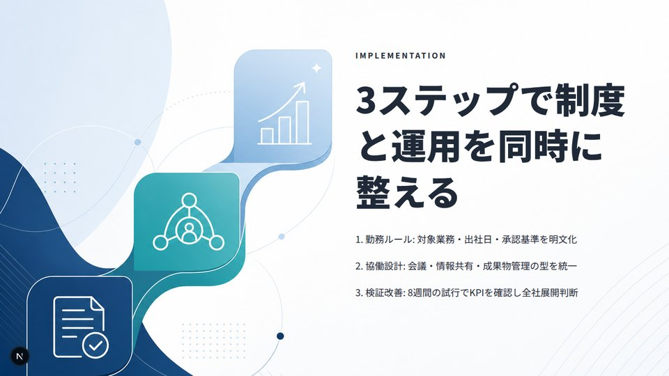
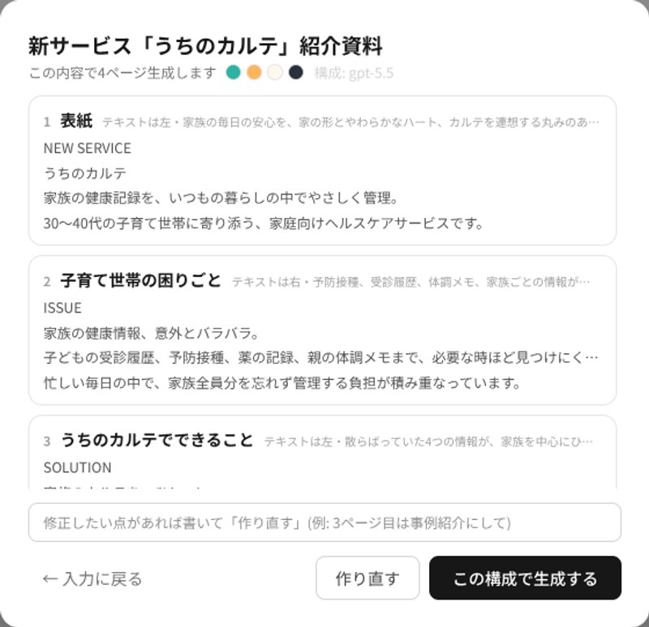

# CompDeck

**Comp-first AI slide generation — pixel-quality AI design that stays fully editable.**

[日本語READMEはこちら](README.ja.md)

AI image models produce stunning slide designs — but as flat, uneditable pixels. Layout engines produce editable slides — but they look like templates. CompDeck does both: it has the AI design each page as a finished *comp* (the designer's term for a comprehensive mock, カンプ), then rebuilds it as an editable deck — background art as an image layer, every headline and paragraph as a real, draggable, restylable text element. Export to PDF with vector text and working hyperlinks.


## How a deck gets made

One free-text prompt ("what do you want to tell, to whom") goes through a multi-stage pipeline:

1. **Plan** — a GPT-5-class model writes the outline: per-page copy, a visual motif derived from each page's message (problem → scattered fragments, 3 steps → three connected shapes, pricing → one standout shape…), where the whitespace should live, and a full art direction (9 color tokens + font pairing). Optionally guided by your **reference images** (brand colors / mood), and optionally grounded by **built-in web research** — a toggle makes the model search the web for real facts (pricing, official names, track record) first, with sources listed on the review screen.
2. **Review** — you see the plan (per-page content + design intent) before any expensive generation. Request changes in plain language, regenerate, then approve.
3. **Comp** — gpt-image renders each page as a full-bleed background design with deliberate negative space and *no text* (text-in-image artifacts are detected by a vision model and regenerated automatically).
4. **Typeset** — a vision model only locates the cleanest empty region; the actual typesetting (sizes, line counts, spacing, alignment, orphan-line avoidance) is deterministic, using full-width/half-width-aware line metrics. Contrast is guaranteed by *measuring* background luminance under every text block — colors flip automatically and translucent scrims appear over busy areas.
5. **Critique** — the finished pages are rendered in headless Chrome and inspected by a vision model; pages with real defects (overlap, overflow, unreadable contrast) are re-typeset automatically.
6. **Layers** *(on demand)* — decompose a page into editable layers (clean backdrop + movable, semantically named motif images) with the ✦ button; the composite is pixel-identical, but everything becomes draggable. Set `AUTO_DECOMPOSE_LAYERS=1` to run this for every page at generation time.

| | | |
|---|---|---|
|  |  |  |

*Unretouched first-shot output. Note the content-linked motifs and the alternating layout rhythm.*



## Everything stays editable

- **Bilingual UI** — English / Japanese chrome, auto-detected from the browser with a one-click toggle; generated deck content follows the language of your prompt
- Drag, resize (8 handles + numeric), inline-edit any element; snap guides, undo/redo, design tokens (change a theme color, every page follows)
- **Per-element AI edits** — rewrite one text block ("shorter, punchier") at constant layout, or regenerate one image in place
- **Per-page regeneration** — redo a page's background and layout while keeping its content; or add a new AI-designed page matching the deck's theme
- **Background decomposition** — split any generated background into a clean backdrop + movable, semantically named motif layers with the ✦ button (per page, on demand). Set `AUTO_DECOMPOSE_LAYERS=1` to do it automatically for every page at generation time (off by default — it adds ~2 gpt-image edits per page)
- **Image tools** — upload (or drag & drop) images, AI-generate transparent illustration parts, AI background removal
- **PDF in** — decompose a slide PDF into clean background + editable text, per page. Text PDFs (PowerPoint/Keynote/Google Slides exports) keep each line's **original position, size and font** so you just retype (no API key, free); image-only PDFs (e.g. NotebookLM) are OCR'd by AI. Decompose the background further with the ✦ button
- **PDF out** — one click, server-side via your installed Chrome: vector text, edge-to-edge 16:9, and hyperlinks that survive

## Quick start

Requires Node.js 20+.

```bash
git clone https://github.com/ken-kurosu/compdeck.git
cd compdeck
npm install
cp .env.example .env.local   # add your OPENAI_API_KEY
npm run dev
```

Open http://localhost:3000 and hit **✦ 資料を作る** (create deck). Without an API key the app runs in demo mode — every editor feature works on a template-generated deck.

Models are resolved at runtime from `/v1/models` (newest `gpt-image-*` / `gpt-5*` available to your key), so new model releases are picked up with no code change. A typical 5-page deck takes ~5 minutes at the default `high` image quality.

### Self-hosting for a team

```bash
curl -fsSL https://raw.githubusercontent.com/ken-kurosu/compdeck/main/scripts/setup.sh | bash
```

One idempotent script: clone/pull → build → generate an access token → run under pm2 (port 3100) → health check. Set `COMPDECK_API_TOKEN` and every page/API is protected; browsers authenticate once via `?token=…` (cookie), API clients via `Bearer`. Decks and generated assets are stored as plain files under `.assets/` — no database to operate.

## Agent / Slack-bot API

CompDeck is built to sit behind a chat agent: plan → review in the channel → approve → get back an edit URL.

```bash
# 1. plan (show this to the user; iterate with feedback + previousPlan)
curl -X POST $URL/api/generate/plan -H "Authorization: Bearer $TOKEN" \
  -H "Content-Type: application/json" -d '{"topic":"Pitch deck for ...","pages":5}'

# 2. once approved
curl -X POST $URL/api/decks -H "Authorization: Bearer $TOKEN" \
  -H "Content-Type: application/json" -d '{"plan": <approved plan>}'
# → { "editUrl": "…/?deck=…&token=…" }  ← post this back to the user
```

See [docs/agent-api.md](docs/agent-api.md) for the full contract.

## Architecture notes

- `lib/image2Pipeline.ts` — the comp-first pipeline. The design decision that makes output reliable: **vision models are only asked questions they can answer well** (where is the empty space? is there stray text?), while everything precision-critical (line breaking, sizing, spacing, contrast) is deterministic and unit-tested (`npm run test:typeset`, `npm run test:contrast`).
- `lib/critique.ts` — render-and-inspect QA loop, reusing the PDF export's headless Chrome.
- `lib/importPdf.ts` — PDF → editable deck. Per page it branches: text-layer PDFs use pdfjs to place each line at its exact position/size/font (text removed by deterministic paint-over, no API key); image-only PDFs fall back to vision OCR + gpt-image text removal.
- 1280×720 fixed coordinate system; decks are plain JSON; themes are 9 color tokens + a font pair; the five Japanese-capable font families are self-hosted via Fontsource so output renders identically offline.

## License

[MIT](LICENSE)
